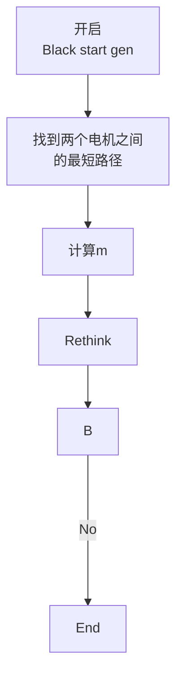

# ASR

### 介绍
AUTOMATIC SYSTEM RESTORATION FOR INDUSTRIAL POWER SYSTEMS

### 文件结构
├─ data_extract  	实例数据提取

│  └─ IEEE30  	IEEE30 实例数据

├─ paper 	 相关论文

├─ templates 	flask template部分

│  └─ static	静态图片与数据

├─ app.py 	web页面启动文件

├─ restore.py 黑启动算法部分

### 安装教程

pip install -r requirement.txt

### 数据表参数说明

#### Generator Parameters

| Parameter  | Description                                    | note                       |
| ---------- | ---------------------------------------------- | -------------------------- |
| name       | Name of generator                              | 数字                       |
| bus        | Index of the bus the generator is connected to | 数字序号                   |
| P_mw       | Real power of the generator                    | 发电机的实际功率           |
| Vm_pu      | Voltage set point                              | 电压设定点 （无数据）      |
| Sn_mva     | Nominal power of the generator                 | 发电机的额定功率（无数据） |
| Max_q_mvar | Maximal reactive power of the generator        | 发电机的最大无功功率       |
| Min_q_mvar | Minimal reactive power of the generator        | 发电机的最小无功功率       |

#### Transformer Parameters

| Parameter | Description       | note |
| --------- | ----------------- | ---- |
| name      | Name of Transformer |      |
| hv_bus    | High voltage bus index of the transformer | 高压侧bus编号 |
| lv_bus    | Low voltage bus index of the transformer | 低压侧bus编号 |
| sn_mva    | rated apparent power of the transformer [MVA] | 变压器额定视在功率[MVA] |
| vn_hv_kv  | rated voltage at high voltage bus [kV] | 高压侧bus的额定电压 [kV] |
| vn_lv_kv  | rated voltage at low voltage bus [kV] | 低压侧bus的额定电压 [kV] |
|**vk_percent**	| **short circuit voltage [%]** | **短路电压** |
|**vkr_percent**| **real component of short circuit voltage [%]** | **短路电压的实际分量[%]** |
|**pfe_kw**| **iron losses [kW]** | **铁损** |
|**i0_percent**| **open loop losses in [%]** | **单位开环损耗** |
|**shift_degree**| **transformer phase shift angle** | **变压器相移角** |
|**tap_side**| **defines if tap changer is at the high- or low voltage side** | **tap插在高压侧还是低压侧的标记‘hv’ or ‘lv’ ** |
|in_service| specifies if the transformer is in service. | 工作status |

#### Bus Parameters

| Parameter | Description       | note |
| ---- | ---- | ---- |
| name      | Name of bus |      |
| bus     |   Index of the bus   | 数字序号 |
| vn_kv     |  rated voltage of the bus [kV]    | 额定电压[kV] |

#### Line Parameters

| Parameter    | Description                   | note         |
| ------------ | ----------------------------- | ------------ |
| name         | Name of bus                   |              |
| from_bus     | Index of bus where the line starts            | bus的数字序号 |
| to_bus       | Index of bus where the line ends| bus的数字序号 |
| length_km    |  length of the line [km]                             |              |
| r_ohm_per_km |       resistance of the line [Ohm per km]                       |              |
| x_ohm_per_km |  inductance of the line [Ohm per km]                             |              |
| c_nf_per_km  |      capacitance of the line [nF per km]                         |              |
| max_i_ka     |   maximal thermal current [kA]                            |              |
| df           |   derating factor (scaling) for max_i_ka                            |              |
| in_service   |  specifies if the line is in service.                             | 一般为TRUE |

#### Load Parameters
| Parameter    | Description                   | note         |
| ------------ | ----------------------------- | ------------ |
|bus| Index of the connected bus | bus序号 |
|const_i_percent	| percentage of p_kw and q_kvar that is associated to constant impedance load at rated voltage [%] | |
|const_z_percent	| percentage of p_kw and q_kvar that is associated to constant current load at rated voltage [%] | |
|in_service| specifies if the load is in service. | |
|name	| Name of the load | |
|p_mw	| active power of the load [MW] | |
|scaling	| scaling factor for active and reactive power | |
|sn_mva| rated power of the load [MVA] | |
|type	| | |
|priority| Specifies the order of load pickup | |

#### Motor Load Parameters

| Parameter    | Description                   | note         |
| ---- | ---- | ---- |
| load_number| The load that motor belongs to                               | 电机所属的负载 |
|load_bus	| Index of the load bus | 负载总线的index |
| motor_HP              | Horsepower motor rating                                      | 马力电机额定值 |
|no_of_motors | Number of motors connected to the load and are of same horsepower. | 无电机连接至负载且功率相同的电机数量。 |
|voltage_kv 	| Rated Voltage of a motor                                     | 电机的额定电压 |
|full_load_current	| Full load Amp (FLA) rating is at which motor will consume power at 100% of rated load | 满载安培（FLA）额定值是指电机在100%额定负载下消耗功率的额定值 |
|power_factor_full_load	| Power factor of the motor | 电机功率因数 |
|efficiency_full_load	| Efficiency at the rated power |额定功率下的效率 |
|power_factor_locked_rotor	|  Locked rotor power factor of the motor |功率因数锁定转子|
|inrush_current|  Starting current of the motor |电动机的起动电流 |

**关于motor load**

Load_number和Load_bus，以识别电机对应的负载。

Motor_hp是电机马力，no_of_motors表示属于相同负载的具有相同马力的电机数量

#### **对于IEEE30中的Motor_load**

假设每个负载的15%是电机负载，因此对应的load_number，load_bus是与load相同的关系

motor_hp在200HP~3500HP之间

### 运行流程

### 输出内容
load相关
每一个迭代过程，开启的load，开启经过的路径，开启时已经开启的发电机
线路总阻抗，每条线路的阻抗，总负载，总
gen相关

